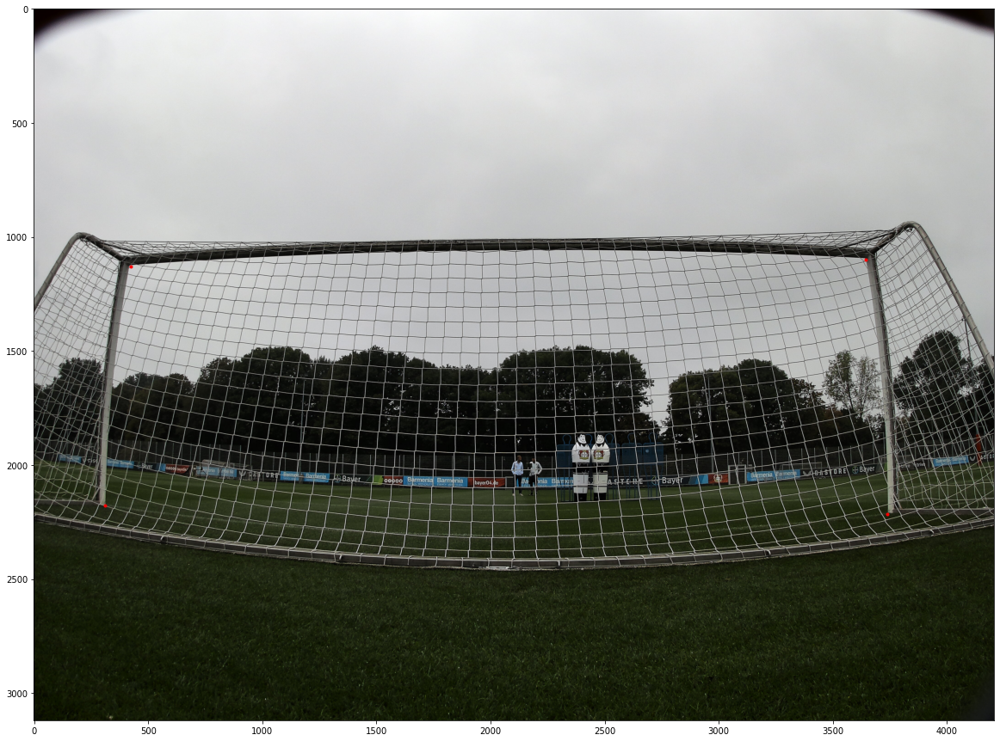

# Master thesis project
Camera Calibration using Automated Detection of Football Goal Corners

This is a repository containing all the code for my Master Thesis project titled as above. The aim is to produce an algorithm that leverages Deep Convolutional Networks to detect the inner corners of a football goal. An example of this detection can be seen in the image below. The detected points are plotted as red points.

